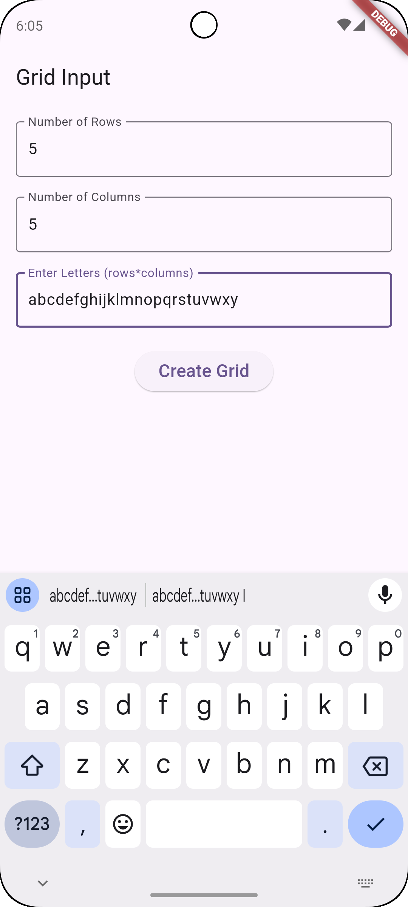
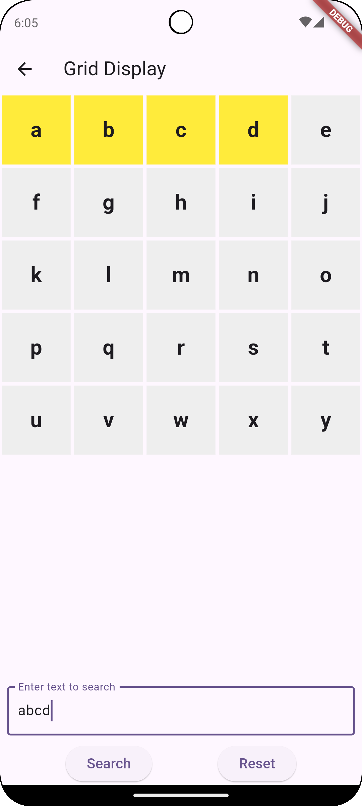

# Grid Search App

## Overview
Grid Search App is a Flutter application that allows users to create a custom letter grid, input a word, and search for it in specific directions (East, South, and South-East). The app highlights the found words and provides a reset option to restart the process.

## Features
- **Splash Screen**
- **Dynamic Grid Creation**: Users specify the number of rows and columns, then enter `rows * columns` letters.
- **Grid Display**: Shows the letter grid.
- **Word Search Functionality**: Users enter a word to search, and if found, the letters are highlighted.
- **Search Directions**:
    - Left to Right (East)
    - Top to Bottom (South)
    - Diagonal (South-East)
- **Reset Feature**: Clears the grid and restarts the process.

## Installation
1. Clone the repository:
   ```sh
   git clone https://github.com/HarshalGupta113/Grid-Search-App.git
   cd grid-search-app
   ```
2. Install dependencies:
   ```sh
   flutter pub get
   ```
3. Run the app:
   ```sh
   flutter run
   ```

## How to Use
1. **Start the app** (Splash screen will appear for 3 seconds).
2. **Enter Grid Size**: Provide the number of rows and columns.
3. **Input Letters**: Enter letters.
4. **Grid Display**: The grid appears with letters placed in order.
5. **Search for a Word**: Enter a word and press "Search".
6. **Highlighted Word**: If the word is found, its letters will be highlighted.
7. **Reset the App**: Click "Reset" to restart the process.

## Screenshots
### Splash Screen


### Grid Input Screen


### Grid Search Screen


Download APK

Download the latest APK from the following link:  
[Download APK](apk/grid_search_app_v1.apk.apk)

## Technologies Used
- Flutter
- Dart
- Material Design


